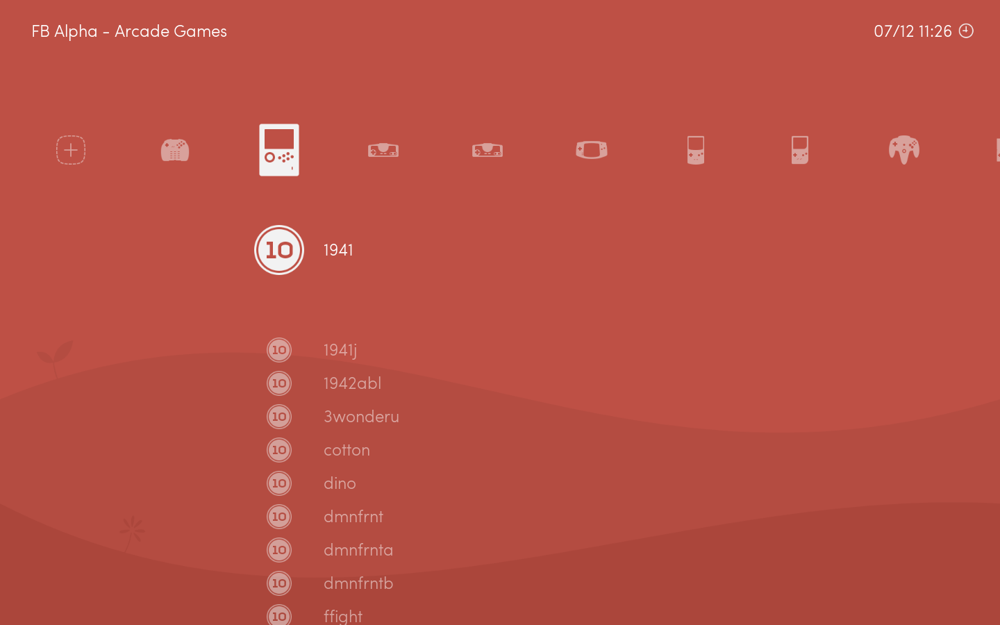

Playlists are the lists of games displayed under each joypad icon in the Lakka graphical interface. Playlists can be generated automatically by the ROM scanning process or be created by users and uploaded to the Lakka device. Playlists are located within the **playlists** folder [which is accessible via SAMBA](http://www.lakka.tv/doc/Accessing-Lakka-filesystem/). 

## Automatic playlist generation

Lakka includes an internal database that can be used to scan ROMs from many kinds of systems in order to automatically generate playlists. In order for the playlist scanner to recognize the ROMs from these systems, they must be formatted according to a standard which varies from system to system.

## Manually setting the Core for a playlist

Generally speaking, Lakka will detect and use the correct core for use with the ROMs that are used as part of a playlist. Under some circumstances, it may be useful to manually set Lakka to use a particular core for one of its playlists. This can be accomplished within the `Playlists` submenu in the Lakka settings.

## Playlist file format
Each playlist is a plain text file, and each entry in a playlist must be composed of 6 lines.

Example playlist entry:

    /storage/roms/n64/Legend of Zelda, The - Ocarina of Time (USA).n64
    Legend of Zelda, The - Ocarina of Time (USA)
    /tmp/cores/mupen64plus_libretro.so
    Nintendo 64 (Mupen64Plus)
    EC95702D|crc
    Nintendo - Nintendo 64.lpl

 1. The path to the ROM
 2. The display name (you can use any name here)
 3. The path to the core, this libretro core will be used to launch the ROM
 4. The displayname of the core, not really useful, we keep it there because the history list is also using this format
 5. Link to the database entry (optional). In this case the link is done by CRC, and in some other cases it is done by serial number. You can omit a link to the database by using the word DETECT here instead.
 6. The name of this playlist, ending in the extension .lpl

## Zipped ROMs
If you use zipped ROMs (other than arcade ROMs), your ROM path will have to look like this:

    /storage/roms/NEC - Super Grafx/Madou King Granzort (Japan).zip#Madou King Granzort (Japan).pce

**Note the # in the path.**

## Scripting

Custom playlists can be generated by some simple scripts. This is particularly useful to generate playlists for systems not supported by our scanning process yet.

You can use this example bash script:

    #!/bin/bash
    
    for fullpath in $1; do
    	echo $fullpath
    	filename=$(basename "$fullpath")
    	echo "${filename%.*}"
    	echo $2
    	echo $3
    	echo "DETECT"
    	echo $4
    done

And invoke it like this:

    ./scan.sh "/storage/roms/arcade/*.zip" "/tmp/cores/fba_libretro.so" "Arcade (FB Alpha - SVN)" "FB Alpha - Arcade Games.lpl" > "/storage/playlists/FB Alpha - Arcade Games.lpl"

Result:

You can also use this script which will test if the ROM has already added to the playlist, to not add it twice:

    #!/bin/bash
    
    #
    # Libretro playlist builder
    #
    # Usage:
    # scan.sh "Files path" "Core" "Core name" "Playlist filename" ["Playlists path"]
    #
    # Example:
    #./scan.sh "/storage/roms/arcade/*.zip" "/tmp/cores/fba_libretro.so" "Arcade (FB Alpha - SVN)" "FB Alpha - Arcade Games.lpl" "/storage/playlists/"
    #
    
    SAVEIFS=$IFS
    IFS=$(echo -en "\n\b")
    CA=0
    CS=0
    
    echo " Scaning \"$1\" for \"$3\" ROMs and adding to \"$5$4\"... "
    
    for fullpath in $1; do
	touch "$4"
	filename=$(basename "$fullpath") 

	if [ `grep -c "$fullpath" "$4"` -lt 1 ]; then
		CA=$(($CA+1))
		echo "$CA - Adding $filename"
		echo $fullpath >> "$5$4"
		echo "${filename%.*}" >> "$5$4"
		echo $2 >> "$5$4"
		echo $3 >> "$5$4"
		echo "DETECT" >> "$5$4"
		echo $4 >> "$5$4"
	else
		CS=$(($CS+1))
		echo "$CS - Skipping $filename"
	fi
    done
    
    echo " Added $CA and skipped $CS \"$3\" ROMs out of $(($CA+$CS)) scanned files to \"$4\" "
    
    IFS=$SAVEIFS

## Icons

If you want your playlist to be displayed with the appropriate icons, you have to name your lpl file like one of the no-intro DAT. See our icons here:

    ls /usr/share/retroarch-assets/xmb/monochrome/png/

Adding your own icons is also possible, there is an overlay system in Lakka that allows you to override the content of `/usr/share/retroarch-assets` by placing files in `/storage/assets `. You have to replicate the same folder hierarchy.
